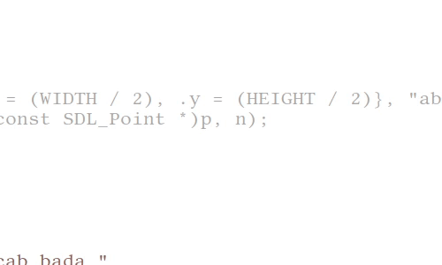

# sdltext
> Small, WIP, single-header, no dependency, text points compiler library 

# Details
Currently only implements a 5x5 font **(size multiplier and/or specifier are WIP)** which supports ASCII **(UTF-8 support is WIP)**, but the API is made to support UTF-8 whilst also having an ergonomic API for ASCII strings.
<br>
Work for basic font formats support is expected, too, but there's no ETA.

# Cool stuff
This primitively implements one of my very basic ideas (transforms) which is a function **(currently takes current character and it's index, returns point)** which allows for easy text manipulation. This may **(very likely will)** be extended to implement stuff such as rotations, too.

## Theoretical scenario
Say I wanted to expose only vowels in a word. Instead of hacking the implementation with multiple calls to a text rendering API, I can simply pass a transformer that automatically does my intended function.

<hr>

# Demonstration

Sine-wave transform + width-wrapping on alphabet + numbers + special characters:
```c
// gdt is an example local pointer to delta time, not offerred by the API
static SDLText_Point sine_transform(char c, unsigned i) {
  (void)c;

  return (SDLText_Point){.x = 0, .y = (int)(sinf((*gdt) * 10 + (float)i) * 2.f)};
}


    p = sdltext_compile_text_ex(
        (SDLText_Point){.x = 3, .y = 10},
        "1234567890\n"
        "!@#$%^&*-=+_()[]{}/\\<>\"'`~;:\n"
        "???dac???,,, hello, world,!@@... DAB			bac cab bada "
        "dabadabada "
        "abcdefghijklmnopqrstuvwxyzabcdefghijklmnopqrstuvwxyzabcdefghijklmnopqr"
        "stuvwxyzabcdefghijklmnopqrstuvwxyzabcdefghijklmnopqrstuvwxyz",
        &n, sine_transform);

    if (p) SDL_RenderDrawPoints(mder.renderer, (const SDL_Point *)p, n);
    free(p);
``` 




<hr>

Rotating circle transform:
```c
#define UPPER_BOUND (unsigned)(('l' + 1) - 'a')
#define DEGS 360 / UPPER_BOUND
#define RADIUS 40
// gdt is an example local pointer to delta time, not offerred by the API
static SDLText_Point rotating_circle_transform(char c, unsigned i) {
  (void)c;

  unsigned offset;
  float rot;
  float rad;
  float o;

  o = fmodf((*gdt) * 50.f, 40.f);
  if (o > 20.f)
    o = 40.f - o;

  rad = RADIUS + o;

  offset = (SDLTEXT_FONT_SIZE + SDLTEXT_FONT_SPACING) * i;

  SDLText_Point p;

  p.x = p.y = 0;
  p.x -= offset;

  rot = fmodf(((DEGS * (float)i) + (*gdt) * 100), 360.f);

	// 57.2958 ~= 360/pi/2
  p.x += (int)(sinf(rot / 57.2958f) * rad);
  p.y -= (int)(cosf(rot / 57.2958f) * rad);

  return p;
}

	p = sdltext_compile_text_ex((SDLText_Point){.x = (WIDTH / 2), .y =
     (HEIGHT / 2)}, "abcdefghijkl", &n, rotating_circle_transform);
	if (p) SDL_RenderDrawPoints(mder.renderer, (const SDL_Point *)p, n);
	free(p);
```


